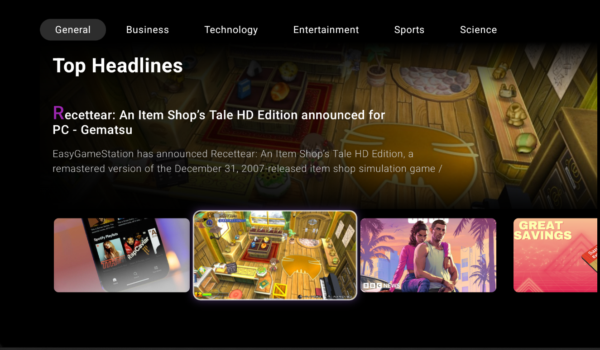
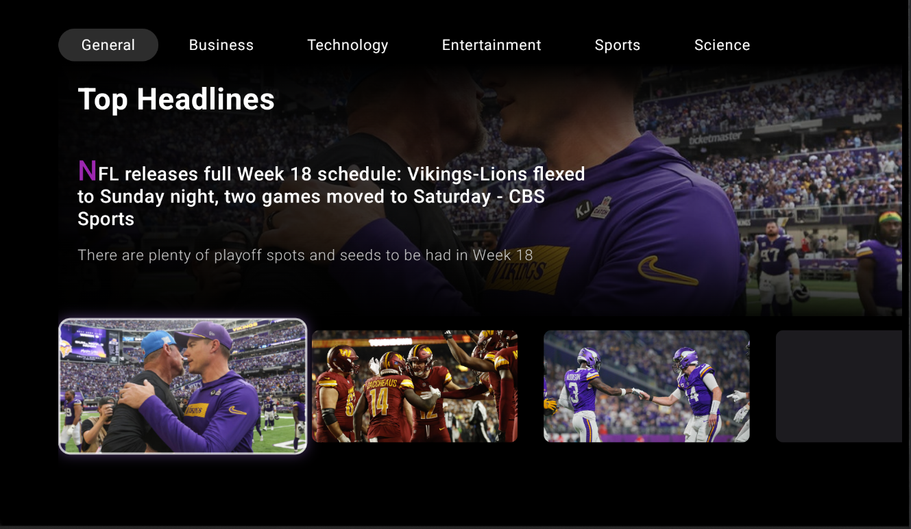

 # Android TV News App 
  
 A modern news application built specifically for Android TV, delivering breaking news and headlines with an immersive viewing experience. 
  
  
  
 ## Features 
  
 - 📺 **TV-Optimized Interface** - Built from ground up for the big screen experience 
 - 🎨 **Material 3 Design** - Modern UI components following Material Design guidelines 
 - 🔄 **Real-time Updates** - Latest news fetched from NewsAPI 
 - 📱 **Jetpack Compose** - Modern UI toolkit for native Android development 
 - ✨ **Immersive List View** - Horizontal scrolling with focus-optimized UI 
 - 🎯 **Category Navigation** - Quick access to different news categories 
 - 🔄 **D-Pad Refresh** - Long press down on D-pad to refresh content 
 - ⚡ **Smooth Loading** - Elegant shimmer effects during content loading 
  
## Demo Video - Youtube

[](https://youtu.be/sKM09rPNyFA)
  
 ## Screenshots 
  
 <table> 
   <tr> 
     <td></td> 
     <td></td> 
   </tr> 
 </table> 

## Documentation

You can view the full documentation of Steps taken, Problems Faced and Fixes Used here: [Download PDF](path/to/your/documentation.pdf)
 
 ## Architecture & Technical Stack 
  
 - **Architecture Pattern**: MVVM (Model-View-ViewModel) 
 - **UI Framework**: Jetpack Compose 
 - **Networking**: Retrofit with OkHttp 
 - **Design System**: Material 3 
 - **API**: NewsAPI for content delivery 
  
 ## Getting Started 
  
 ### Prerequisites 
 - Android Studio Arctic Fox or later 
 - Android TV device or emulator 
 - NewsAPI key 
  
 ### Setup 
 1. Clone the repository 
 ```bash 
 git clone https://github.com/yourusername/tv-news-app.git 
 ``` 
  
 2. Add your NewsAPI key in `local.properties`: 
 ```properties 
 NEWS_API_KEY=your_api_key_here 
 ``` 
  
 3. Build and run the project using Android Studio 
  
 ## Remote Control Navigation 
  
 - **Left/Right**: Navigate through news articles 
 - **Up/Down**: Switch between categories 
 - **Long Press Down**: Refresh content 
 - **Center/Enter**: Select article for detailed view 
  
 ## Contributing 
  
 Pull requests are welcome! For major changes, please open an issue first to discuss what you would like to change. 
  
 ## Acknowledgments 
  
 - [NewsAPI](https://newsapi.org/) for providing the news content 
 - Material 3 design system 
 - Jetpack Compose documentation and community 
  
 --- 
  
 Built with ❤️ for Android TV 
